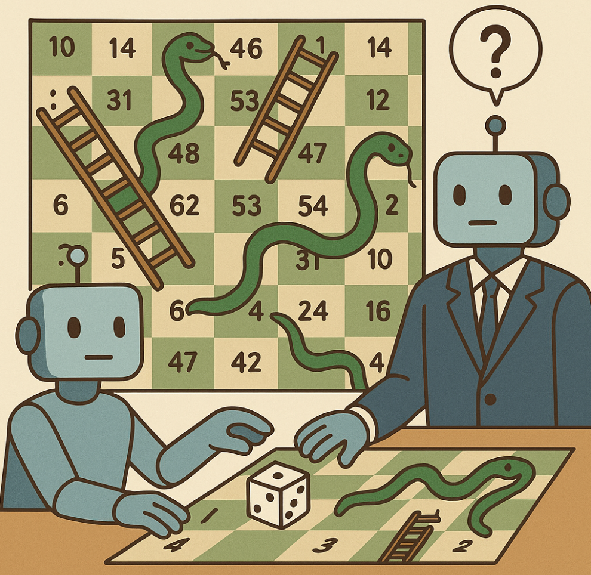

# *Snakes and Ladders*  Exploring LLM Generalization Through Games

    

The board game [Snakes and Ladders](https://en.wikipedia.org/wiki/Snakes_and_ladders) (or Chutes and Ladders) inspires a new benchmark for measuring the generalization capabilities of LLM across different rulesets and board configurations. We compare the performance of LLMs when acting in multiple roles:

* **Gamemaster** - We evaluate the ability of an LLM to act as a gamemaster. In this role, the LLM must track the game and player states, where "understanding" is measured through a series of questions posed to the gamemaster after a number of moves.
* **Player** - Unlike the traditional luck-based version of Snakes and Ladders, we allow the LLM to pick the outcome of their dice roll. In the player role, we measure the ability of an LLM to "think" strategically and select an optimal set of moves under a given ruleset.

The work of Chu et al. in [SFT Memorizes, RL Generalizes](https://arxiv.org/abs/2501.17161) motivates further work to understand the impact of post-training method on generalization when applied here. 
